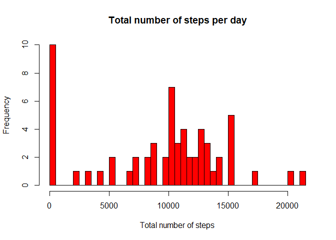
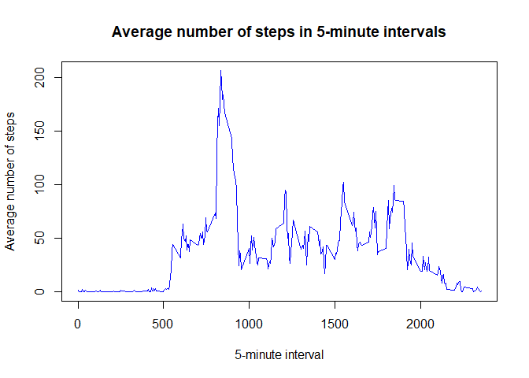
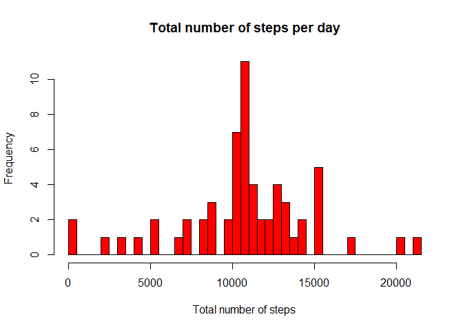
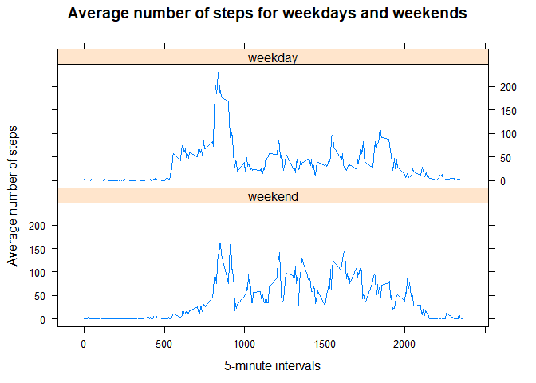

## Loading and preprocessing the data
This code unzips the data file and reads it into dataframe. Then the character date variable is converted to Date format.


```r
fname <- as.character(unzip("activity.zip", list = TRUE)$Name)
dataset<-read.csv(unz("activity.zip", fname), stringsAsFactors = F)
dataset$date<-as.Date(dataset$date)
```


```
## 
## Attaching package: 'dplyr'
```

```
## The following objects are masked from 'package:stats':
## 
##     filter, lag
```

```
## The following objects are masked from 'package:base':
## 
##     intersect, setdiff, setequal, union
```

## What is mean total number of steps taken per day?
This code creates a dataframe with total number of steps taken per date. Then plots the histogram and calculates the *mean* and *median* of the total steps taken on all dates.

```r
newset<-summarise(group_by(dataset, date), totalSteps=sum(steps, na.rm=TRUE))
with(newset, hist(totalSteps, col="red", breaks=50, xlab = "Total number of steps", 
                  main="Total number of steps per day"))
```

<!-- -->

```r
meanTotalSteps<-mean(newset$totalSteps)
medianTotalSteps<-median(newset$totalSteps)
```
The mean total number of steps is 9354.2295082 and the median total number of steps is  10395.


## What is the average daily activity pattern?
This code creates a dataframe with average number of steps taken per time interval, then plots the average number of steps per 5-minute interval. The largest number of steps is taken in the morning intervals, between 8:00am to 9:30am, almost no steps are taken at night. 

```r
newset1<-summarise(group_by(dataset, interval), aveSteps=mean(steps, na.rm=TRUE))
with(newset1, plot(interval, aveSteps, col="blue", type = "l", xlab="5-minute interval", 
                  ylab="Average number of steps", lwd=1, 
                  main="Average number of steps in 5-minute intervals"))
```

<!-- -->

```r
intervalMax<-newset1$interval[newset1$aveSteps==max(newset1$aveSteps)]
```

The time interval with maximum average number of steps is 835.

## Imputing missing values
This code checks which variables contain missing values and how many. 

```r
missingValues<-sum(is.na(dataset$steps))
missingIntervals<-sum(is.na(dataset$interval))
missingDate<-sum(is.na(dataset$date))
```
Only the steps variable contains missing values. There are 2304 row with missing values in the dataset.


To fill in all of the missing values in the dataset, use the mean number of steps for that 5-minute interval, from the dataframe newset1 above. The new dataframe, dataset1, is the same as the original dataframe, dataset, but with missing values filled in.


```r
dataset1<-dataset
for (i in 1:nrow(dataset1)) {
    if (is.na(dataset1$steps[i])) {
      dataset1$steps[i]<-newset1$aveSteps[newset1$interval==dataset1$interval[i]]
    }  
}
```

This code plots the histogram of the total number of steps taken each day and calculates the **mean** and **median** total number of steps taken per day. 


```r
newset2<-summarise(group_by(dataset1, date), totalSteps=sum(steps, na.rm=TRUE))
with(newset2, hist(totalSteps, col="red", breaks=50, xlab = "Total number of steps", 
                  main="Total number of steps per day"))
```

<!-- -->

```r
meanTotalSteps1<-mean(newset2$totalSteps)
medianTotalSteps1<-median(newset2$totalSteps)
```

The new mean total number of steps is 1.0766189\times 10^{4} and the new median total number of steps is  1.0766189\times 10^{4}, which are different from the estimates from the first part. As a result of imputing missing data, the mean and median of the estimates of the total daily number of steps became equal.

## Are there differences in activity patterns between weekdays and weekends?

This code creates a new factor variable in the dataset1 with two levels -- "weekday" and "weekend" indicating whether a given date is a weekday or weekend day. 


```r
weekdays1 <- c('Monday', 'Tuesday', 'Wednesday', 'Thursday', 'Friday')
dataset1$weekDay <- factor((weekdays(dataset1$date) %in% weekdays1), 
                   levels=c(FALSE, TRUE), labels=c('weekend', 'weekday'))
newset3<-summarise(group_by(dataset1, weekDay, interval), aveSteps=mean(steps, na.rm=TRUE))
```

This code makes a panel plot of the 5-minute interval (x-axis) and the average number of steps taken, averaged across all weekday days or weekend days (y-axis). 


```r
xyplot(aveSteps~interval|weekDay, data=newset3, type = "l", layout=c(1,2), 
       xlab="5-minute intervals", ylab="Average number of steps", 
       main="Average number of steps for weekdays and weekends")
```

<!-- -->

There are more steps taken in the mornings on weekdays then on weekends. The steps start to accumulate later in the morning on weekends.


